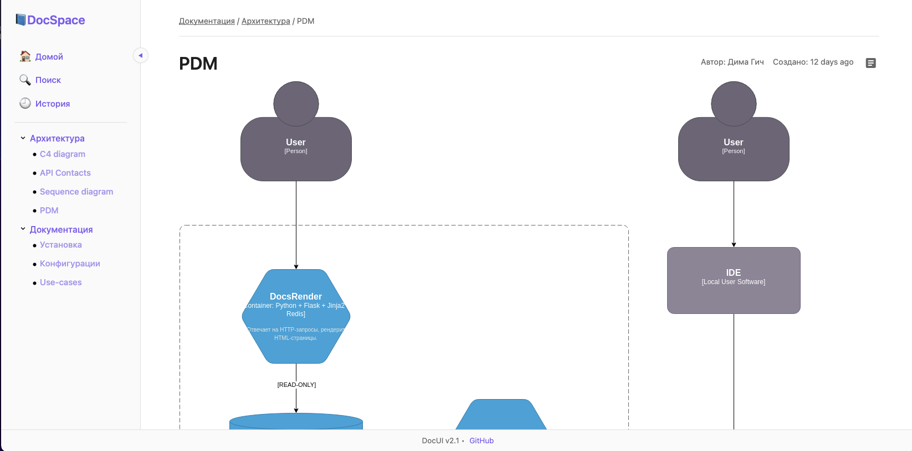
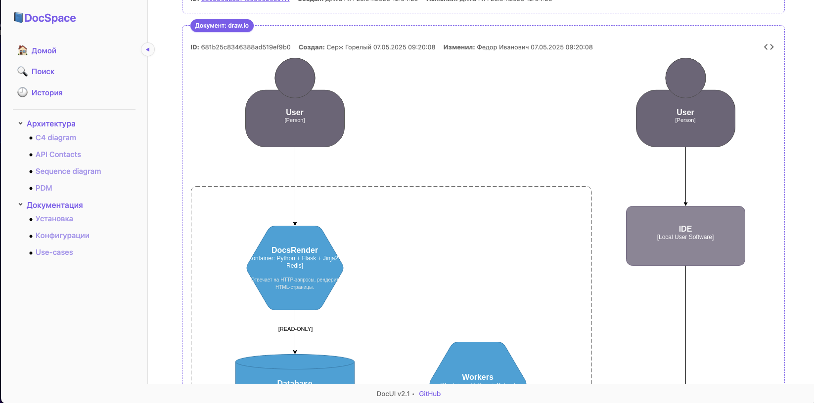
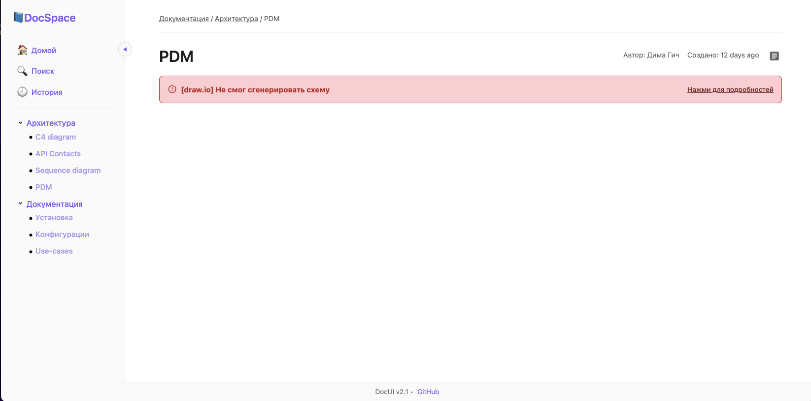
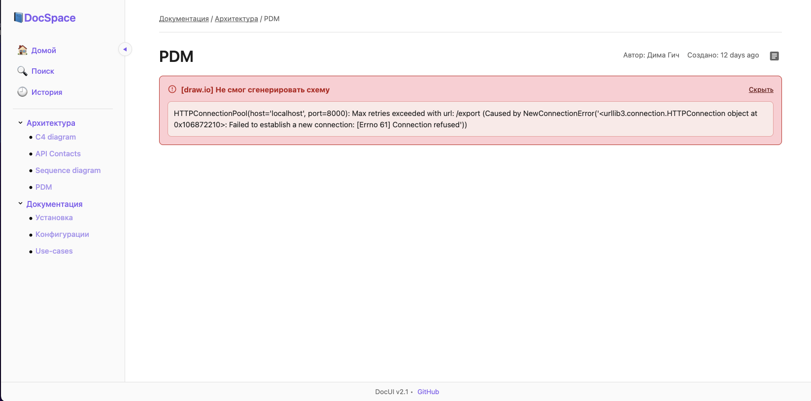
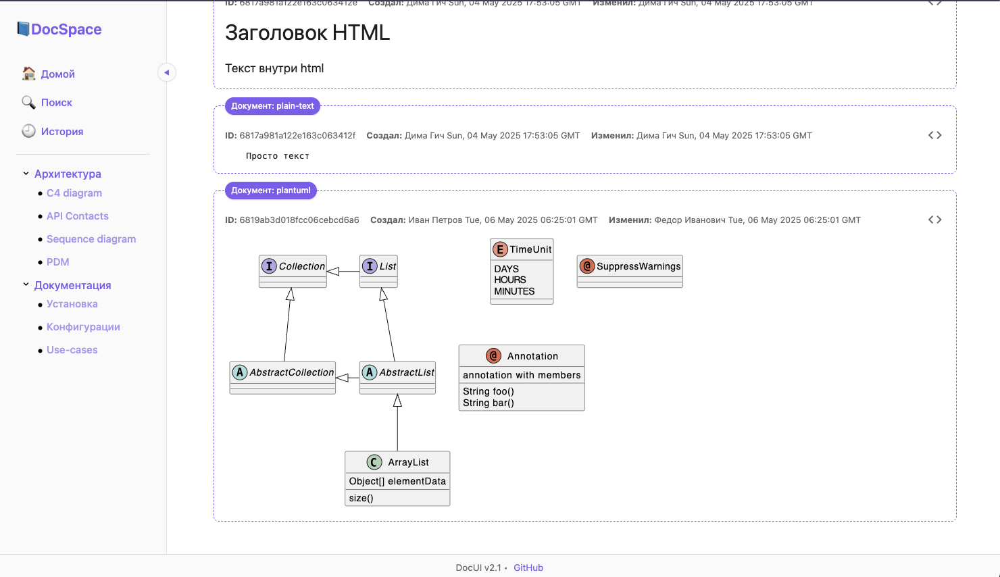
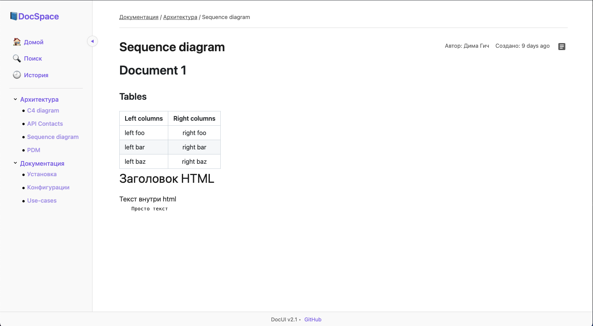
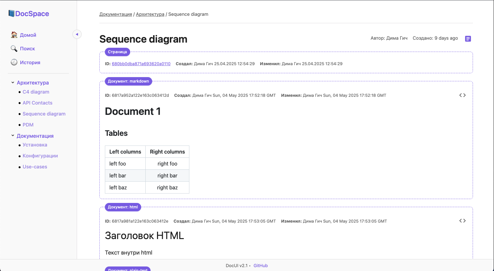
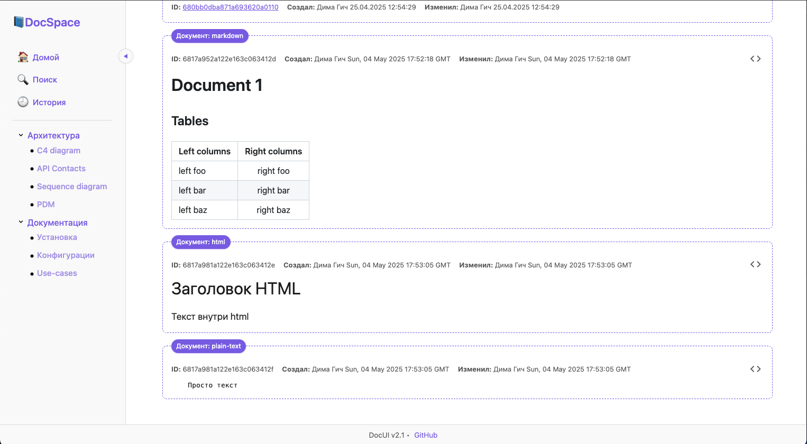
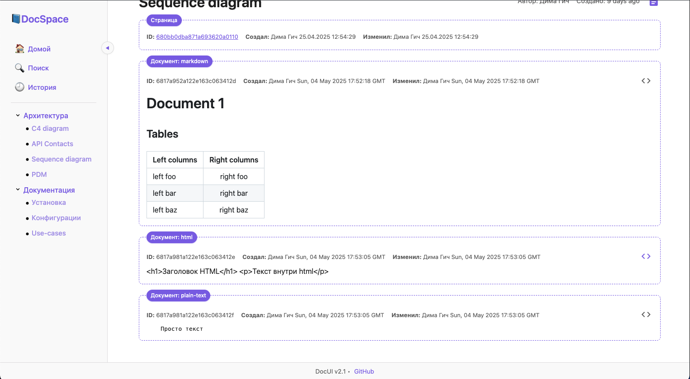
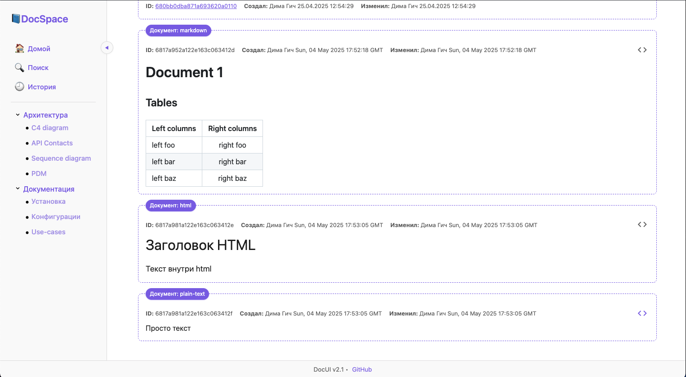

## 07.05.2025
1. Подключена remote-server генерация draw.io (по другому не вышло)

*С включенным layout*

2. Реализована core логика запросов контента с внешних серверов core.http.client
3. Реализован функционал, чтобы ловить ошибки генерации и выводить их в красивом виде + давать сразу детализацию entities.content 

## 06.05.2025
1. Подключена server-side генерация PlantUML

2. Сделан рефакторинг routes и templates - теперь они разложены по подпапкам для удобства работы
3. Сделана асинхронная загрузка рендера контента (подготовка к remote-server генерациям)
4. Сделана особая заглушка на длительную загрузку контента
5. Сделан рефакторинг style.css 

## 04.05.2025

1. Добавлен вывод на 1 странице нескольких документов

2. Добавлен функционал работы с layout + отображение метаданных по странице и по каждому документу на странице

3. Добавлено отображение документов с типом HTML 

4. Добавлено отображение документов с типом plain-text

1. Добавлена асинхронная загрузка документов на странице

## 02.05.2025
**Большой рефакторинг веб портала**

1. Для безопасного обращения к элементам из MongoDB данных реализованы модели => core/mongo
2. На все коллекции монго добавлены схемы валидации, которые являются неотъемлемой частью работы моделей
3. Реализована модель Pages => Страницы документации
4. Реализована модель Docs => Сами документы с контентом
5. Реализована работа с сущностями entities
6. Реализована сущность Navigation => Иерархическая навигая по докумнетации на базе модели Pages
7. Реализована сущность Content => Контент страниц с типизацией и генераций
8. Реализована server-side генерация Markdown контента
9. Подключено логирование
10. Все роуты из run.py выведены в папку routes и подключаются через register_blueprint
11. Инициализация всех основных атрибутов и функций app вынесена из run.py во внутрь build_app()

