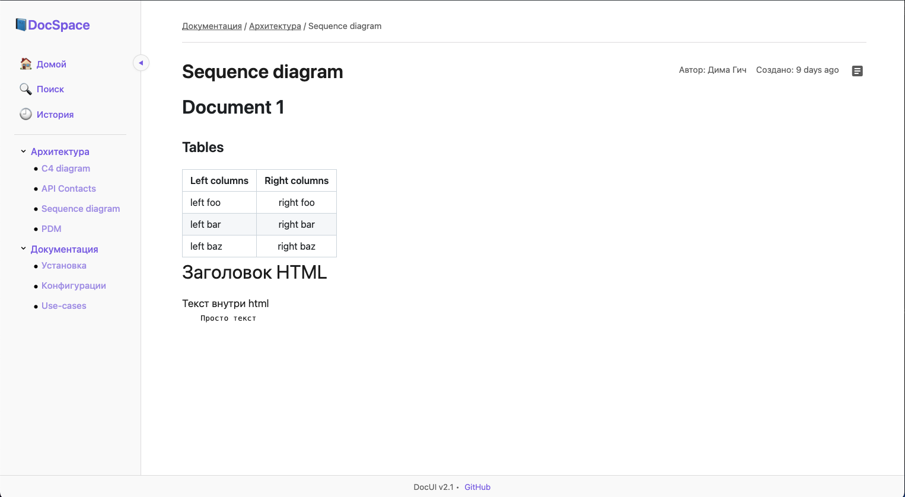
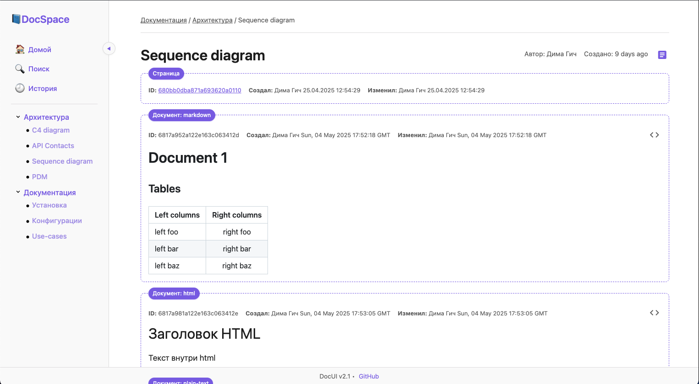
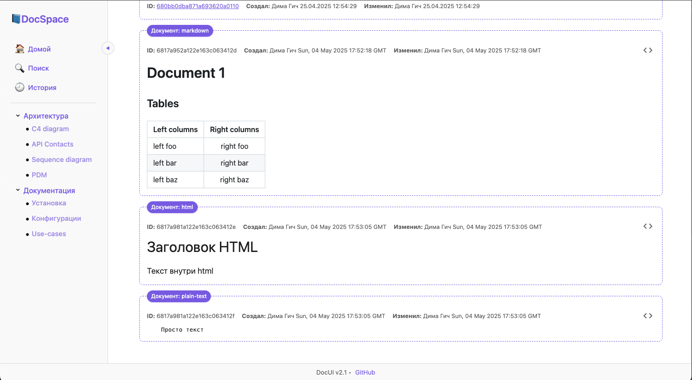
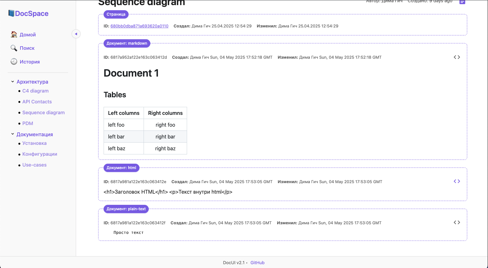
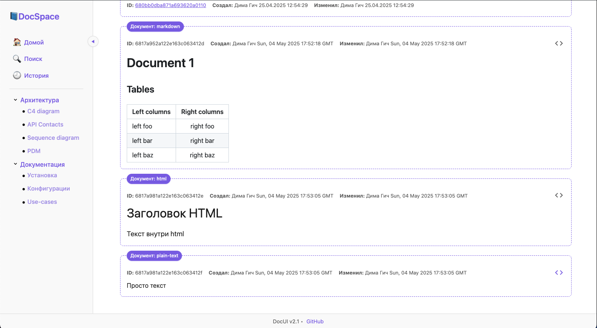
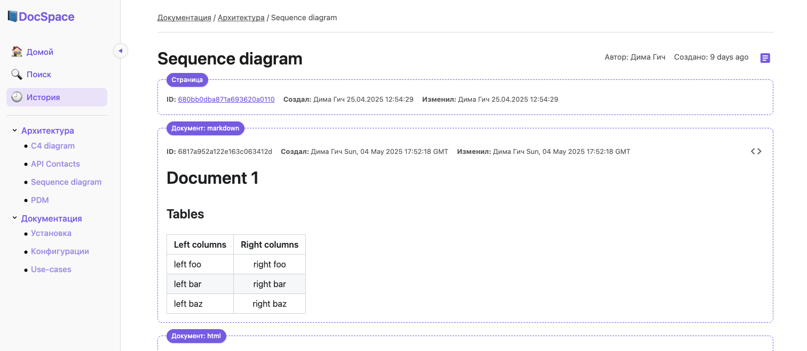

## 04.05.2025

1. Добавлен вывод на 1 страниц нескольких документов и отображение метаданных по странице и по каждому документу на странице

2. Добавлен функционал работы с layout

3. Добавлено отображение документов с типом HTML 

4. Добавлено отображение документов с типом plain-text

5. Добавлена асинхронная загрузка блоков документов

## 02.05.2025
**Большой рефакторинг веб портала**

1. Для безопасного обращения к элементам из MongoDB данных реализованы модели => core/mongo
2. На все коллекции монго добавлены схемы валидации, которые являются неотъемлемой частью работы моделей
3. Реализована модель Pages => Страницы документации
4. Реализована модель Docs => Сами документы с контентом
5. Реализована работа с сущностями entities
6. Реализована сущность Navigation => Иерархическая навигая по докумнетации на базе модели Pages
7. Реализована сущность Content => Контент страниц с типизацией и генераций
8. Реализована server-side генерация Markdown контента
9. Подключено логирование
10. Все роуты из run.py выведены в папку routes и подключаются через register_blueprint
11. Инициализация всех основных атрибутов и функций app вынесена из run.py во внутрь build_app()

